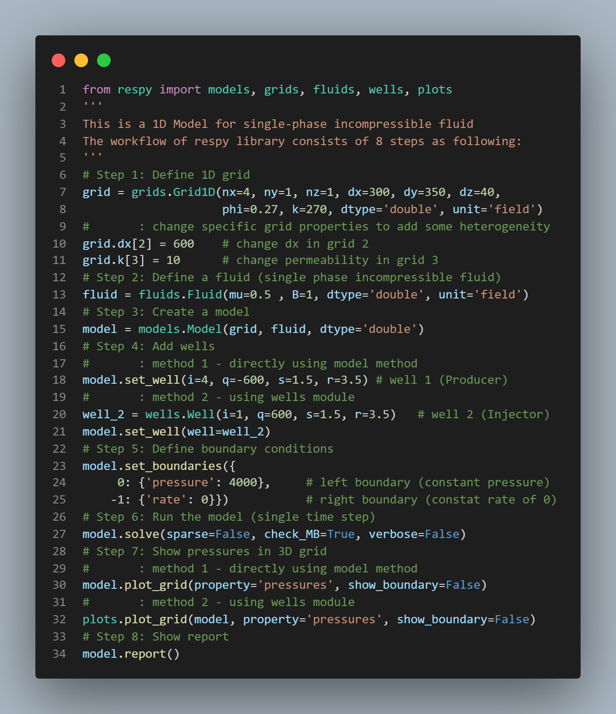
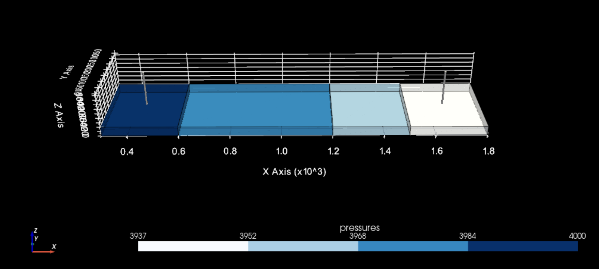

# Python Petroleum Reservoir Simulator - respy

## Introduction

## Toturial

### Example 1

- Code:

- Visualization:

## Reference

1. Create a Python Libraries:
   * [How to create a Python library.](https://medium.com/analytics-vidhya/how-to-create-a-python-library-7d5aea80cc3f)
   * [3D Visualization](https://docs.pyvista.org/examples/00-load/create-uniform-grid.html)
2. Improve Performance:
   * [Speeding up Python and NumPy: C++ing the Way.](https://medium.com/coding-with-clarity/speeding-up-python-and-numpy-c-ing-the-way-3b9658ed78f4)
