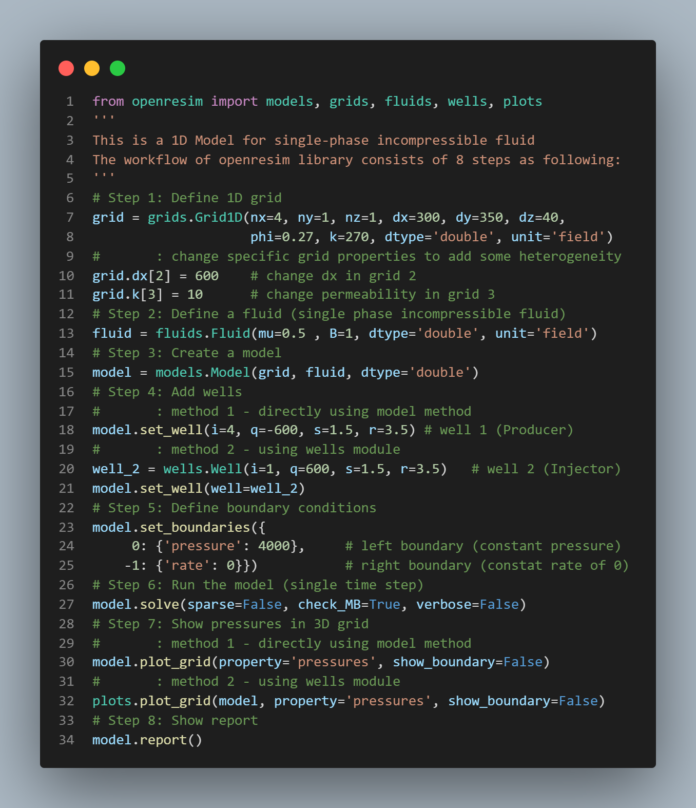

# Open Reservoir Simulation Library <`openresim`>

> Petroleum Reservoir Simulation using Scientific Computing and Machine Learning With Python developed by [Zakariya ABUGRIN](https://github.com/zakgrin).

## Introduction

Open Reservoir Simulation Library, shortly `openresim`, is a modern open-source python library that helps petroleum reservoir engineers to be proficient scientists and engineers who are able to express their practical and scientific knowledge by coding.

This library is designed based on the modern Python stack for data science and scientific computing. Hence, this library is directly integrated with AI and ML Python frameworks and libraries.

The author follows the intuitive pythonic way to design this library. This should allow to build complex reservoir simulation models that are both innovative and efficient.

The following convention is used to import `openresim` after installation:

```python
import openresim as rs
```

`openresim` is designed to achieve the highest quality use cases and research for reservoir engineering and simulation. Solutions that can combine the strength scientific computing with the power of machine learning including state-of-the-art deep learning models. Below are some examples for the problems that will be tackled

- Reinforcement Learning to achieve better production strategies.
- Deep Learning to perform history matching.

## Version

[Semantic Versioning](https://semver.org/) is used for the version numbers. Since this library is still under development, `major=0` is used until a stable version is reached.

## Capabilities


| **Feature**         | **Type**       | **Support** |
| --------------------- | ---------------- | ------------- |
| **Grid Type**       | Cartesian      | Yes         |
|                     | Radial         | No          |
| **Dimension**       | 1D             | Yes         |
|                     | 2D             | No          |
|                     | 3D             | No          |
| **Phases**          | Single Phase   | Yes         |
|                     | Two Phases     | No          |
|                     | Three Phases   | No          |
|                     | Compositional  | No          |
| **Compressibility** | Incompressible | Yes         |
|                     | Compressible   | No          |

## Installation

### Install python

### Install the python library

```bash
git clone https://github.com/zakgrin/openresim.git
cd openresim
```


### Setup a python environment

```bash
python -m venv .venv
```

# Choose one option:

# 1. For windows

```bash
source .venv/Scripts/activate
```

# 2. For Linux or Mac

```bash
source .venv/Scripts/activate
pip install -r requirements.txt
pip install .
```

## Tutorials

### Example 1



